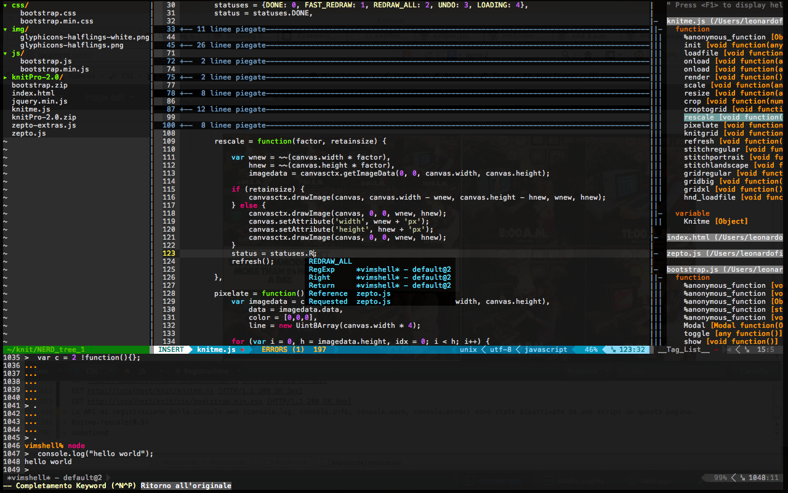
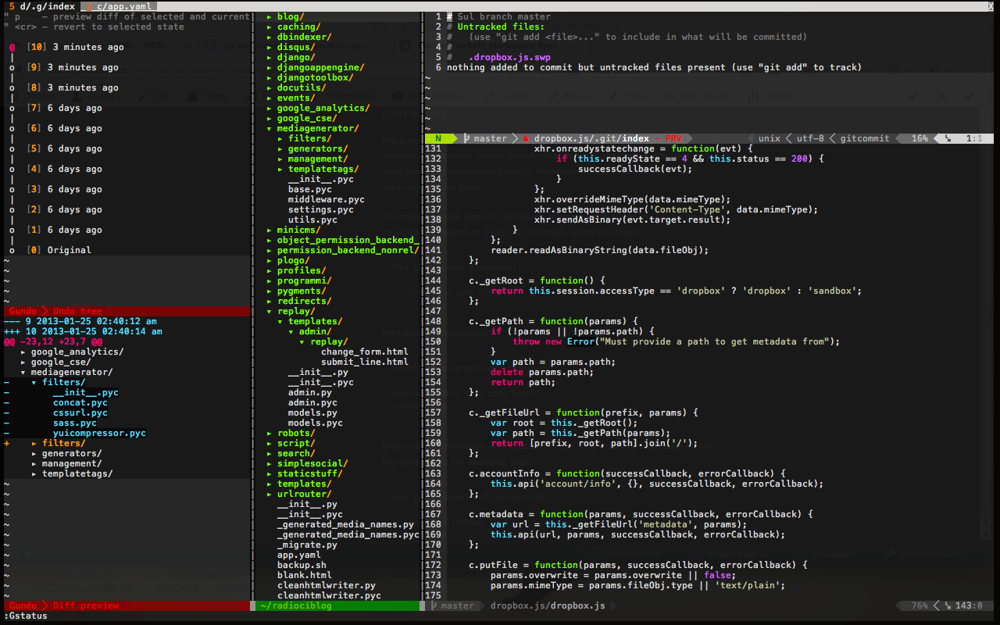

.vimrc Configuration
====================

This is my personal vim configuration, optimized for C/C++, Python, and web developement (JS, CSS, HTML etc.).
Is suited for OSX, using iTerm2 (thus 256 colors, real fullscreenness and more other), but i'm pretty sure
is quite portable to *nix systems.

UI packages
-----------

* AutoTag
* vim-taglist-plus
* gundo.vim
* cmdalias.vim
* vim-nerdtree-tabs
* vim-powerline
* vimproc
* vimshell
* IndexedSearch
* manpageview
* neocomplcache
* nerdtree
* snipmate.vim
* syntastic
* tagbar
* unite.vim
* vim-matchit
* vitality.vim
* vim-indent-guides
* zencoding-vim

Development
-----------

* clang_complete

* html5.vim
* jQuery
* jedi-vim
* jscomplete-vim
* vim-javascript
* vim-javascript-syntax
* vim-json
* vim-css3-syntax

* python-mode

* vim-latex

* vim-markdown

SCM
---

* vim-fugitive
* vim-git

Colorschemes
------------

* 256-grayvim
* 256-jungle
* beauty256
* calmar256-light
* charged-256
* colorful256
* desert256
* devbox-dark-256
* gummybears
* matrix
* molokai
* mrkn256
* obsidian
* obsidian2
* oceanblack256
* robokai
* simple256
* solarized
* sonofobsidian
* summerfruit256
* trivial256
* twilight256
* wombat256
* wombat256mod
* xoria256

Usage
-----
Clone this repo then, 

    ln -s repo/path/vimrc ~/.vimrc
    ln -s repo/path/vim ~/.vim

aaaaand you are done. On OSX, In order to use fancy icons for vim-powerline, you need to install vim/powerlineotf/Menlo-Powerline.otf and use it as font for iTerm2.

Known bugs
----------

* keyboard mappings for tabs management. Surely i don't understand how [in]map works. 
